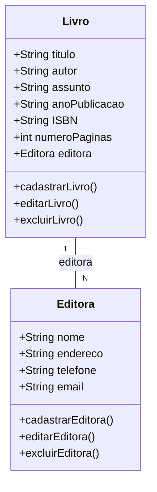

# Sistema de Biblioteca Caseira
## Modelagem e Diagramação Sistema Biblioteca Caseira.
### O objetivo deste documento é especificar os requisitos para o desenvolvimento de um sistema de biblioteca caseira que permitirá ao usuário cadastrar livros e editores, além de realizar pesquisas detalhadas sobre os livros cadastrados.

